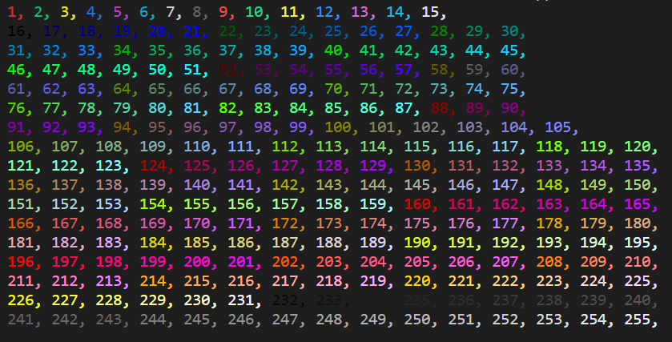
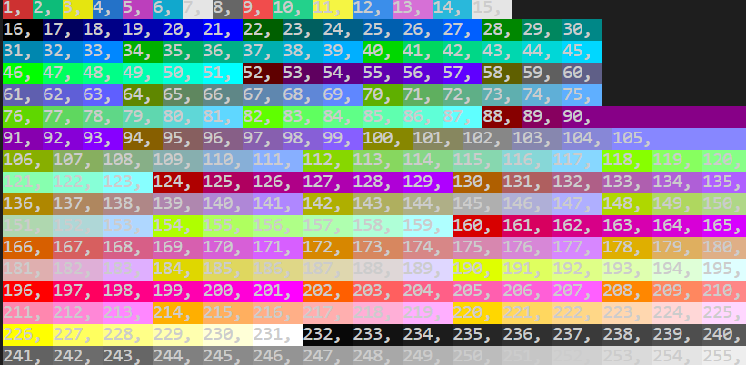
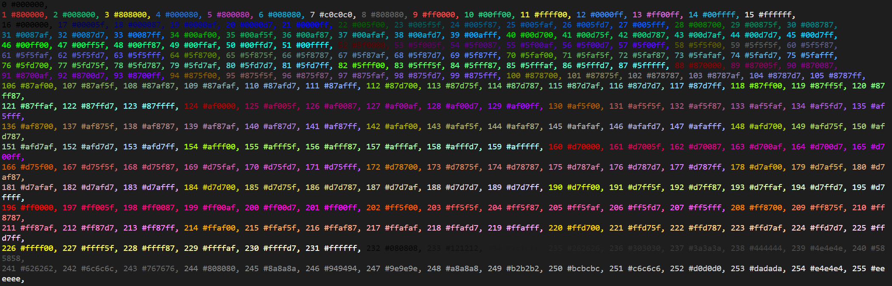
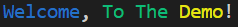

# CookBook

This cookbook is a collection of demos of the coloredterm module.

If you do not have it installed please go to the [installing page](install.md).

# All foregrounds

We will first show a demo script to show all foregrounds.
Here it is:
```py
# Import foreground function to print the foreground.
from coloredterm import fg

# Setup a loop to print all ansi codes for the fg function.
for i in range(1, 256):
    if int(i) % 15 == 0:
        print(fg(i)+str(i), end=", \n")
    else:
        print(fg(i)+str(i), end=", ")

```

In the program we make a range from 1 to 256.
Then we first see if the number is a multiple of 15 and if it after printing use a line break. If it is not then we end with a ``, ``.

This outputs:


# All backgrounds

Now we will show almost the same thing but for background

Here it is:
```py
# Import background function to print the background. Also Style so we can clear the background after each print.
from coloredterm import bg, Style

# Setup a loop to print all ansi codes for the bg function.
for i in range(1, 256):
    if int(i) % 15 == 0:
        print(bg(i)+str(i), end=", \n")
        print(Style.RESET, end="")
    else:
        print(bg(i)+str(i), end=", ")
        print(Style.RESET, end="")


```

In the program we make a range from 1 to 256.
Then we first see if the number is a multiple of 15 and if it after printing use a line break. If it is not then we end with a ``, ``.

Resetting the background after each print.

This outputs:   


# ForeGrounds and there hex codes
Here we will show a way you can find the hex code for all of the foregrounds.

For this we will use the colors dictionary from coloredterm.
This is a dictionary with all the ansi codes and there hex.
Using this we can make this:
```py
# Import dictionary with all ansi codes and there hex. Import foreground function to print the foreground.
from coloredterm import colors, fg

for i in colors:
    if int(i) % 15 == 0:
        print(fg(int(i))+i+" "+colors[i], end=", \n")
    else:
        print(fg(int(i))+i+" "+colors[i], end=", ")
```

This will output:



# Pattern Print

The pattern print function prints the next color in a pattern. So if we make a list of the patterns we want it to follow then it will start the pattern.


```py
from coloredterm import pattern_print

# The pattern_print function lets you print text with the color being the next one in the pattern.

# Simplify so you do not need do put in the pattern variable.

pattern = ["blue", "green", "yellow"]

# Pattern is only required on the first print statement.

pattern_p("Welcome", pattern ,end=", ")
pattern_p("To The", end=" ")
pattern_p("Demo", end="!")
```

This will output:

