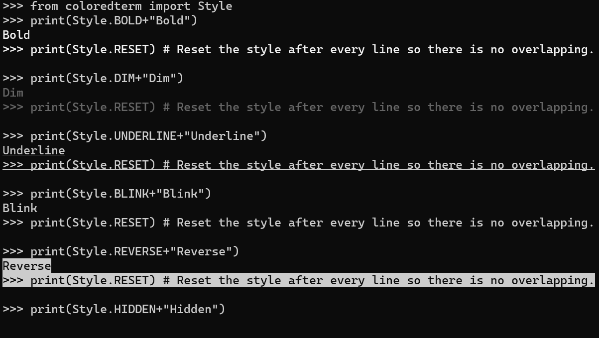

# Coloredterm

ColoredTerm is a collection of different tools to change the color of your terminal.

# Examples

Here we will show some basic examples with coloredterm functions.

## ForeGround
The ForeGround function can be found as fg.
The function lets you change the terminal foreground.
Here is an example:

```py
from coloredterm import fg
print(f'{fg("#0000ff")}ForeGround')
```

This will output:


This will also work if you use a rgb value.

Just put in ``fg((0, 0, 255))``, Changing the tuple to have the r, g and b value you want it to have.

## BackGround
The BackGround function found as bg is very similar to the [ForeGround](#foreground) function.

It runs the same way but changes the background instead of the foreground.

Here is an example:
```py
from coloredterm import bg
print(f"{bg('#00ff00')}BackGround")
```
This will output:


Same as in [ForeGround](#foreground) rgb values work by putting in a tuple.

## Style
Now here comes the style class.

Style is a collection of different items you can use to change how the terminal works.

Here is the list:

RESET: Reset all colors and backgrounds.
BOLD: Make all text bold.
DIM: Make the text dimmer.
UNDERLINE: Underline all text.
BLINK: Make the text blink.
REVERSE: Turn the foreground to the background and background to the foreground.
HIDDEN: Turn text invisible.

To use any of these just put in your terminal ``style.RESET`` replacing reset with any of the items above.


Here is an example of running all of them:
```py
from coloredterm import Style
print(Style.BOLD+"Bold")
print(Style.RESET) # Reset the style after every line so there is no overlapping.
print(Style.DIM+"Dim")
print(Style.RESET) # Reset the style after every line so there is no overlapping.
print(Style.UNDERLINE+"Underline")
print(Style.RESET) # Reset the style after every line so there is no overlapping.
print(Style.BLINK+"Blink")
print(Style.RESET) # Reset the style after every line so there is no overlapping.
print(Style.REVERSE+"Reverse")
print(Style.RESET) # Reset the style after every line so there is no overlapping.
print(Style.HIDDEN+"Hidden")
```

Running this looks like: 


## Fore
Now for the Fore function.
The Fore function has 14 colors.

### These are the colors:

BLACK,
RED,
GREEN,
YELLOW,
BLUE,
PURPLE,
CYAN,
WHITE,
LIGHTBLACK_EX,
LIGHTRED_EX,
LIGHTGREEN_EX,
LIGHTYELLOW_EX,
LIGHTBLUE_EX,
LIGHTMAGENTA_EX,
LIGHTCYAN_EX,
LIGHTWHITE_EX.

As an example of using them:
```py
from coloredterm import Fore
print(Fore.BLUE)
```
You can replace blue with any color on the [list above](#these-are-the-colors).

## Back
Back is almost the same as [Fore](#fore).
The only difference is that it fills the background while [Fore](#fore) fills the foreground.
Back has the same colors as [Fore](#fore) to apply it just use:
```py
from coloredterm import Back
print(back.GREEN)
```
You can replace green with any color on the [list](#these-are-the-colors:).

## Colored

Colored has the same colors as [Fore](#fore) and [Back](#back) being this [list](#these-are-the-colors:).

It lets you use background, foreground and style.

Here is a example:
```py
from coloredterm import colored
print(colored("Colored", "blue", "green", "bold"))
```

This outputs:


Only text is required for the colored function.
To change text color alone you can do ``color = None``
To change the background alone you can do ``on_color = None``
To change the style you can do ``style = None``

## Cprint

The cprint function is a combination of print and colored.
It takes the same variables but just ``cprint("Cprint", "blue", None, "bold")`` instead of ``print(colored("Cprint", "blue", None, "bold"))``.

